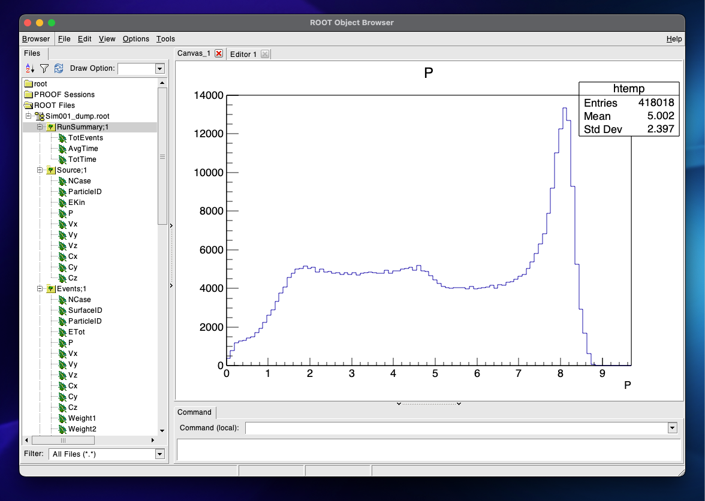

# FlukaROOTOutput

With this code is possibile to compile and executable that produces a FLUKA output in ROOT format. The code is adapted and simplified from here https://fluka-forum.web.cern.ch/t/saving-the-output-as-root-file/2361 and here http://www.fluka.org/fluka.php?id=examples&sub=example3.

Modifica per sebba

The Makefile compile a C++ file called `Flulib.cpp` that contains all the variables needed to save almost everything inside `mgdraw.f`. The Makefile compile the routines using FLUKA `fff` tool. By default it will compile using all the optional FLUKA libraries, consider deactivating them if not needed. It also contains various fixes for MacOs, considering removing them when unecessary.

Tested and working with `ROOT 6.32.02` and `FLUKA 4-4.1` compiled with `MacPorts gcc12.4.0_1` on`Darwin 23.6.0 arm64 (M1)`.

### Prerequisites
- Install [FLUKA](https://fluka.cern/).
- Install [ROOT](https://root.cern/).

Add the following cards to the input file (refer to the [FLUKA manual](https://flukafiles.web.cern.ch/manual/index.html)):
1. `USRICALL`: empty
2. `USROCALL`: empty
3. `USERDUMP`: 
    1. W(1):100
    2. W(2): unit number to use (i.e. 99) 
    3. W(3): what part of mgdraw to activate, usually `2` is enough
    4. W(4): rembember to set it to `1` if you want to activate entry USDRAWS

- Then use the function defined in `Flulib.cpp` inside the correct routines. Refer to the files inside `ExampleRoutines` on how to use them.

### Usage

1. Download the repo:
    `gh repo clone AntoninoFulci/FlukaROOTOutput`
2. Specifying the files to compile. 
    Either by command line:
    `make NAME=executablename OBJS="mgdraw.o usrini.o usrout.o"`
    or inside the Makefile, in that case:
    `make`
3. Run fluka with the executable:
    `rfluka -M 1 -e RootFlukaExecutables/rootfluka example.inp`

### Utilities
1. Modify the variable `makefile_dir` inside the file `compilerf.sh` to point to the directory where FlukaROOTOutput was cloned.
2. Source `compilerf.sh` on your shell (or at your `.*rc`).
    For `zsh`:
    `source path_to_repo/compilerf.sh`

This add several functions:

- `compilerf`: this permits to compile routines while in another directory and save the executable in the default directory (`path_to_repo/RootFlukaExecutables`).
    Usage:
    `compilerf rootflukaname routine1.f routine2.f ecc.f`
- `compilerf_clean`: attempt to clean the executable with the name passed from the default directory where it was compiled.
    Usage:
    `compilerf rootflukaname`
- `compilerf_cleanall`:  clean the default directory of FlukaROOTOutput executables (`path_to_repo/RootFlukaExecutables`).

