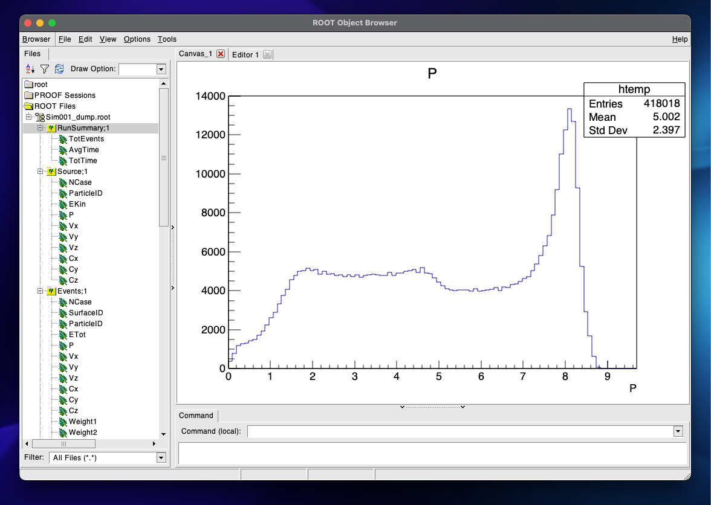

# FlukaROOTOutput

This project allows you to compile an executable that produces FLUKA output directly in ROOT format. The code is adapted and simplified from discussions on the[FLUKA Forum](https://fluka-forum.web.cern.ch/t/saving-the-output-as-root-file/2361) and the [official FLUKA examples](http://www.fluka.org/fluka.php?id=examples&sub=example3).



The `Makefile` compiles a C++ library containing all the variables and functions needed to save data inside `mgdraw.f`. **It now supports two ROOT data formats:**
- `FluLib.cpp` (Default): Saves data using the standard ROOT `TTree` structure.
- `FluLibRNTuple.cpp`: Saves data using the modern, high-performance ROOT `RNTuple` structure.

The routines are compiled using the FLUKA `fff` tool. By default, it compiles using all optional FLUKA libraries (consider deactivating them in the Makefile if not needed). It also contains various linker fixes for macOS.

*Tested and working with `ROOT 6.38.04` and `FLUKA 4-5.2` compiled with `MacPorts gcc14.3.0_0` on `Darwin 25.4.0 arm64 (M4 Pro)`.*

---

### Structure of the Produced ROOT File

Depending on your compilation choice, the library writes a file called `dump.root` containing either `TTree` or `RNTuple` objects. The data structure is organized as follows:

* **`RunSummary` (`SimulationSummary`)**
  * Stores run‑level information.
  * **Branches:**
    * `StartTime` (`std::time_t`, saved as integer) – Timestamp when the simulation started.
    * `TotEvents` (`Int_t`) – Total number of events processed.
    * `AvgTime` (`Double_t`) – Average time per event.
    * `TotTime` (`Double_t`) – Total simulation time.

* **`Source`** – Primary particle source information (one entry per primary, created on the first `sourcefill` call).
  * **Branches:**
    * `NCase` (`Int_t`) – Event / primary index.
    * `ParticleID` (`Int_t`) – FLUKA particle code.
    * `EKin`, `P` (`Double_t`) – Kinetic energy and momentum.
    * `Vx`, `Vy`, `Vz` (`Double_t`) – Position of the source.
    * `Cx`, `Cy`, `Cz` (`Double_t`) – Direction cosines.
    * `Weight` (`Double_t`) – Statistical weight.

* **`Events`** – Surface crossings / transport events (created on the first `treefill` call).
  * **Branches:**
    * `NCase`, `SurfaceID`, `ParticleID` (`Int_t`) – Event index, surface identifier, FLUKA particle code.
    * `ETot`, `P` (`Double_t`) – Total energy and momentum.
    * `Vx`, `Vy`, `Vz` (`Double_t`) – Interaction / tracking position.
    * `Cx`, `Cy`, `Cz` (`Double_t`) – Direction cosines.
    * `Weight1`, `Weight2` (`Double_t`) – Transport / scoring weights.
    * `MotherID`, `ProcessID` (`Int_t`) – Parent track ID and process code.
    * `MotherETot` (`Double_t`) – Total energy of the parent.
    * `MotherVx`, `MotherVy`, `MotherVz` (`Double_t`) – Position of the parent interaction.
    * `UniqueID` (`Double_t`) – Unique identifier for the step or track.

* **`DepEvents`** – Energy‑deposition events (subset of FLUKA `mgdraw` information, created on the first `depfill` call).
  * **Branches:**
    * `NCase`, `RegionID`, `ICode`, `ParticleID` (`Int_t`) – Event index, region, interaction/deposition code, and FLUKA particle code.
    * `ETot`, `P` (`Double_t`) – Total energy and momentum at deposition.
    * `Vx`, `Vy`, `Vz` (`Double_t`) – Position of the deposition.
    * `Cx`, `Cy`, `Cz` (`Double_t`) – Direction cosines.
    * `Weight1`, `Weight2` (`Double_t`) – Statistical weights.
    * `MotherID`, `ProcessID` (`Int_t`) – Parent track and process codes.
    * `MotherETot` (`Double_t`) – Total energy of the parent.
    * `MotherVx`, `MotherVy`, `MotherVz` (`Double_t`) – Position of the parent interaction.

* **`USDEvents`** – Events from the `USERDUMP` / USDRAW‑related routines (created on the first `usdfill` call).
  * **Branches:**
    * `NCase`, `RegionID`, `ICode`, `ParticleID` (`Int_t`).
    * `EKin`, `P` (`Double_t`) – Kinetic energy and momentum.
    * `Vx`, `Vy`, `Vz` (`Double_t`) – Position.
    * `Cx`, `Cy`, `Cz` (`Double_t`) – Direction cosines.
    * `Weight` (`Double_t`) – Statistical weight.
    * `MotherID` (`Int_t`) – Parent track ID.
    * `MotherETot` (`Double_t`) – Total energy of the parent.

*All trees/ntuples are written and the file is closed automatically when `fileclose` is called at the end of the FLUKA run.*

---

### Prerequisites

- [FLUKA](https://fluka.cern/) must be installed.
- [ROOT](https://root.cern/) must be installed.

You will need to add the following cards to your FLUKA input file (refer to the [FLUKA manual](https://flukafiles.web.cern.ch/manual/index.html)):

1. `USRICALL`: (Leave empty)
2. `USROCALL`: (Leave empty)
3. `USERDUMP`:
   * **WHAT(1):** `100`
   * **WHAT(2):** Unit number to use (e.g., `99`)
   * **WHAT(3):** What part of `mgdraw` to activate (usually `2` is enough)
   * **WHAT(4):** Set to `1` if you want to activate `USDRAW` entries.

*Note: Use the functions defined in `src/FluLib.cpp` (or `src/FluLibRNTuple.cpp`) inside the correct FLUKA user routines. Refer to the files inside the `examples/` folder for guidance.*

---

### Usage

1. **Clone the repository:**
   ```bash
   gh repo clone AntoninoFulci/FlukaROOTOutput
   cd FlukaROOTOutput
   ```

2. **Compile the executable:**
   
   To compile using the standard **`TTree`** output (`FluLib.cpp`):
   ```bash
   make
   ```
   
   To compile using the modern **`RNTuple`** output (`FluLibRNTuple.cpp`):
   ```bash
   make USE_RNTUPLE=1
   ```

   *Optional:* You can specify a custom executable name and define which Fortran objects to compile directly from the command line:
   ```bash
   make NAME=myexecutable OBJS="mgdraw.o usrini.o usrout.o"
   ```

3. **Run FLUKA with the executable:**
   ```bash
   rfluka -M 1 -e RootFlukaExecutables/rootfluka example.inp
   ```

---

### Utilities

To make compiling easier from any working directory, a bash script (`compilerf.sh`) is provided.

1. **Setup environment variables:** Add the directory containing the project Makefile to your shell configuration file (`~/.bashrc` or `~/.zshrc`):
   ```bash
   export FLUKA_ROOT="/path/to/FlukaROOTOutput"
   ```
2. **Source the script:** Load the helper functions into your shell:
   ```bash
   source /path/to/FlukaROOTOutput/scripts/compilerf.sh
   ```

**Available Commands:**

* **`compilerf`**: Compiles routines from your current directory and saves the executable to the default `RootFlukaExecutables` folder.
  * **Standard (TTree) Usage:** 
    ```bash
    compilerf myexecname routine1.f routine2.f
    ```
  * **RNTuple Usage (New):** Add the `--rntuple` flag to automatically compile against `FluLibRNTuple.cpp`.
    ```bash
    compilerf --rntuple myexecname routine1.f routine2.f
    ```

* **`compilerf_clean`**: Cleans the specific executable and its related objects.
  ```bash
  compilerf_clean myexecname
  ```

* **`compilerf_cleanall`**: Cleans the entire `RootFlukaExecutables` directory.
  ```bash
  compilerf_cleanall
  ```